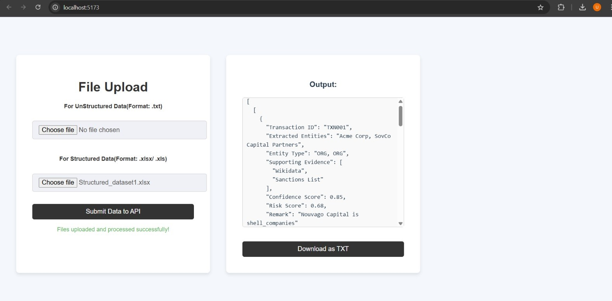

# 🚀AI Driven Entity Risk Analysis

## 📌 Table of Contents

- [🚀AI Driven Entity Risk Analysis](#ai-driven-entity-risk-analysis)
  - [📌 Table of Contents](#-table-of-contents)
  - [🎯 Introduction](#-introduction)
  - [🎥 Demo](#-demo)
  - [💡 Inspiration](#-inspiration)
  - [⚙️ What It Does](#️-what-it-does)
    - [Transaction Analysis](#transaction-analysis)
    - [Entity Screening](#entity-screening)
    - [Data Enrichment](#data-enrichment)
    - [Risk Reporting](#risk-reporting)
  - [🛠️ How We Built It](#️-how-we-built-it)
    - [Backend Architecture](#backend-architecture)
      - [🌐 API Endpoints](#-api-endpoints)
        - [`/upload`](#upload)
    - [External Data Integration](#external-data-integration)
    - [Frontend Development](#frontend-development)
    - [Data Processing Pipeline](#data-processing-pipeline)
    - [Development Tools](#development-tools)
  - [🚧 Challenges We Faced](#-challenges-we-faced)
  - [🏃 How to Run](#-how-to-run)
  - [🏗️ Tech Stack](#️-tech-stack)
  - [👥 Team](#-team)

---

## 🎯 Introduction

Currently data analysts spend a significant amount of manual time and effort to analyze party names from transaction details to determine the correct entities involved. The process becomes more cumbersome and complicated when dealing with several corporations, non-profits, and potential shell companies.The goal of this challenge is to build an AI-driven system that will help to extract entity names from structured and unstructred data and classify entities into different categories. This assigns a risk score based on different entity attributes and provides supporting evidence and confidence scores to assist analysts in decision-making.

## 🎥 Demo

🔗 [Live Demo](#) (if applicable)  
📹 [Video Demo](#) (if applicable)  
🖼️ Screenshots:




## 💡 Inspiration

As particiapnts diving into the Wells Fargo Global Hackathon 2025, we were captivated by the challenge of tackling financial fraud through technology. The idea struck us when we learned that banks still heavily rely on manual processes to screen transactions for potential risks - this felt like a perfect opportunity to apply our classroom knowledge of AI and machine learning to solve a real-world problem.

What really drove us was discovering that:

Financial analysts spend countless hours manually reviewing transaction details
Traditional systems often miss sophisticated money laundering schemes
Small banks struggle to maintain comprehensive risk assessment systems
Modern financial crimes are getting more complex with shell companies and international networks
We thought, "What if we could build something that combines the cutting-edge tech - APIs, machine learning, and modern web development - to help solve this?". Our goal became clear: create an intelligent system that could:

- Automatically extract and analyze entity information
- Cross-reference multiple international databases
- Calculate risk scores based on real banking parameters
- Present findings in a way that makes analysts' jobs easier

## ⚙️ What It Does

Our risk assessment system provides automated analysis of financial transactions to detect potential money laundering and fraud risks. Key features include:

### Transaction Analysis

- Processes structured data (Excel/CSV) containing transaction details
- Analyzes transaction patterns and amounts to identify suspicious activities
- Calculate risk scores based on multiple parameters

### Entity Screening

- Screens entities against multiple watchlists and databases:
  - FATF high-risk jurisdictions
  - Known shell companies from WikiData
  - UN sanctions list
  - Registered NGOs and charitable organizations
- Uses this data to categorize transaction participants

### Data Enrichment

- Augments transaction data with additional context through
- Maintains local cache of external data to ensure system reliability

### Risk Reporting

- Generates comprehensive risk assessment reports
- Visualizes risk scores and suspicious patterns
- Highlights high-risk transactions and entities requiring further investigation
- Identifies to identify unusual patterns

The system provides a user-friendly web interface built with React, making it easy for compliance officers to review and investigate potential risks in financial transactions.

## 🛠️ How We Built It

We developed this risk assessment system using a modern tech stack with separate frontend and backend services:

### Backend Architecture

- Built a RESTful API using **FastAPI** framework for high performance and async support
- Implemented key data processing modules:
  - **Entity Extraction**: Automatic extraction of entities from transaction data
- **Risk Scoring**: Advanced risk assessment based on multiple parameters
- **Data Processing**: Handles both structured (Excel) and unstructured (Text) data
- **External Data Integration**: Connects with multiple authoritative sources

#### 🌐 API Endpoints

##### `/upload`

- **Method**: POST
- **Description**: Processes files for entity extraction and risk analysis
- **Accepts**:
  - Excel files (.xlsx)
  - Text files (.txt)
- **Returns**: JSON with risk analysis results

### External Data Integration

- Integrated multiple data sources through the [`api.py`](code/src/backend/api.py) service:
  - FATF high-risk jurisdictions list
  - WikiData for shell company identification
  - UN sanctions list for blacklisted entities
  - NGO registry data
- Implemented local caching using JSON files to improve performance and handle API failures

### Frontend Development

- Built using **React** with **Vite** for optimal development experience
- Utilized modern React features and hooks for state management
- Implemented responsive design for better user experience
- Connected to backend via RESTful API endpoints

### Data Processing Pipeline

1. Raw transaction data ingestion (Excel/CSV/Text formats)
2. Entity extraction and classification
3. Risk scoring based on multiple parameters
4. Results visualization and reporting

### Development Tools

- Version Control: Git
- Package Management: npm (frontend), pip (backend)
- Development Environment: VS Code with Python and React extensions

## 🚧 Challenges We Faced

Describe the major technical or non-technical challenges your team encountered.

## 🏃 How to Run

1. Clone the repository

   ```sh
   git clone https://github.com/ewfx/aidel-alpha-dominators.git
   ```

2. Install dependencies for frontend

   ```sh
   cd ./code/src/frontend
   npm install
   ```

3. Run the frontend

   ```sh
   npm run build
   npm run dev
   ```

   It should start the frontend on localhost with port 5173

4. Install dependencies for backend

   ```sh
   cd ./code/src/backend
   python -m venv .venv
   .\.venv\Scripts\activate #to activate virtual environment in the terminal
   Set-ExecutionPolicy -Scope Process -ExecutionPolicy Bypass #if running .venv is disabled in terminal, execute this first
   pip install -r requirements.txt
   ```

5. Run the backend

   ```sh
   fastapi dev api.py
   ```

   It should start the backend on localhost with port 8000

6. Testing the frontend

   ```sh
   npm run test # for executing test suite
   ```

## 🏗️ Tech Stack

- 🔹 Frontend: React
- 🔹 Backend: FastAPI
- 🔹 Data Processing: Pandas
- 🔹 ML Models: Spacy
- 🔹 External APIs: Wikidata, UN Sanctions List

## 👥 Team

- **Shaswata Raha** - [GitHub](https://github.com/shaswata1029)
- **Anirban Dey** - [GitHub](#)
- **Utkarsh Kumar** - [GitHub](https://github.com/Utkarsh14022002)
- **Subhradeep Maiti** - [GitHub](https://github.com/Subhradeep-Maiti)
- **Shashank Racharla** - [GitHub](#)
